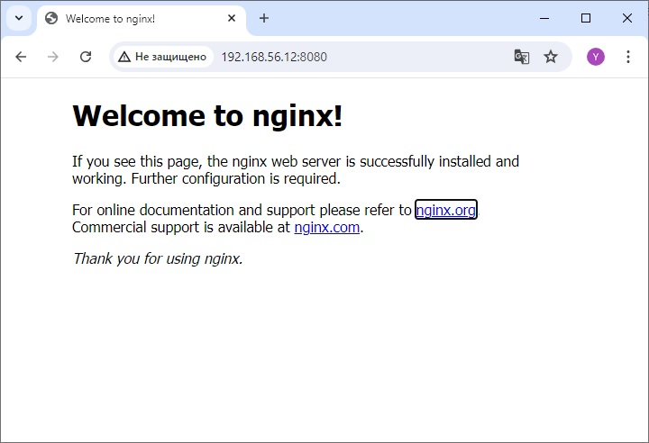

# Otus Homework 20. Iptables.
### Цель домашнего задания
Написать сценарии iptables.
### Описание домашнего задания
1. Реализовать knocking port
    - centralRouter может попасть на ssh inetrRouter через knock скрипт
2. Добавить inetRouter2, который виден с хоста или форвардится порт через localhost
3. Запустить nginx на centralServer
4. Пробросить 80й порт на inetRouter2 8080. Дефолт в инет оставить через inetRouter.
5. (*) Реализовать проход на 80й порт без маскарадинга
## Выполнение
Возьмем за основу схему из задания [Архитектура сетей](https://github.com/nikitinya89/otus_hw18_network). Добавим **inetRouter2** и соединим его с **inetRouter**, используя свободную подсеть *192.168.255.12/30*. Итоговая схема сети примет следующий вид:

#### Реализовать port knocking
**Port knocking** — это сетевой защитный механизм, действие которого основано на следующем принципе: сетевой порт является по-умолчанию закрытым, но до тех пор, пока на него не поступит заранее определённая последовательность пакетов данных, которая «заставит» порт открыться.  
  
Можно настроить port knocking с использованием демона **knockd**, но попробуем настроить доступ, используя только iptables. Для демонстрации, настроим правила на сервере **inetRouter** на интерфейсе *eth1*, смотрящем в сторону **centralRouter**. Доступ по ssh с хоста закрывать не будем.
```bash
iptables -N TRAFFIC
iptables -N SSH-INPUT
iptables -N SSH-INPUTTWO
iptables -A INPUT -i eth1 -j TRAFFIC
iptables -A TRAFFIC -i eth1 -m state --state ESTABLISHED,RELATED -j ACCEPT
iptables -A TRAFFIC -i eth1 -m state --state NEW -m tcp -p tcp --dport 22 -m recent --rcheck --seconds 30 --name SSH2 -j ACCEPT
iptables -A TRAFFIC -i eth1 -m state --state NEW -m tcp -p tcp -m recent --name SSH2 --remove -j DROP
iptables -A TRAFFIC -i eth1 -m state --state NEW -m tcp -p tcp --dport 9991 -m recent --rcheck --name SSH1 -j SSH-INPUTTWO
iptables -A TRAFFIC -i eth1 -m state --state NEW -m tcp -p tcp -m recent --name SSH1 --remove -j DROP
iptables -A TRAFFIC -i eth1 -m state --state NEW -m tcp -p tcp --dport 7777 -m recent --rcheck --name SSH0 -j SSH-INPUT
iptables -A TRAFFIC -i eth1 -m state --state NEW -m tcp -p tcp -m recent --name SSH0 --remove -j DROP
iptables -A TRAFFIC -i eth1 -m state --state NEW -m tcp -p tcp --dport 8881 -m recent --name SSH0 --set -j DROP
iptables -A SSH-INPUT -m recent --name SSH1 --set -j DROP
iptables -A SSH-INPUTTWO -m recent --name SSH2 --set -j DROP
iptables -A TRAFFIC -i eth1 -j DROP
```
- Создаются 3 новые цепочки: **TRAFFIC**, **SSH-INPUT**, **SSH-INPUTTWO**
- Все входящие пакеты перенаправляются в цепочку **TRAFFIC**
- При подключении к *8881* порту, соединение сбрасывается, а IP-адрес добавляется в список **SSH1**
- При подключении к *7777* порту, если IP-адрес присутствует в списке **SSH0**, соединение перенаправляется в цепочку **SSH-INPUT**
- Новые соединения в цепочке **SSH-INPUT** сбрасываются, а их IP-адрес добавляется в список **SSH1**
- При подключении к *9991* порту, если IP-адрес присутствует в списке **SSH1**, соединение перенаправляется в цепочку **SSH-INPUTTWO**
- Новые соединения в цепочке **SSH-INPUTTWO** сбрасываются, а их IP-адрес добавляется в список **SSH2**
- Если IP-адрес зарегестрирован в спике **SSH2**, при обращении по *22* порту, он открывается на 30 секунд

Таким образом, при последовательном обращении к *8881*, *7777* и *9991* портам для конкретного IP-адреса появляется 30-секундное окно для подключиния по SSH по *22* порту. При этом сами порты *8881*, *7777* и *9991* сбрасывают соединения, и не будут доступны для сканеров портов. Для того, чтобы *постучаться* в нужные порты, можно использоваться утилиту **nmap**, написав простой скрипт, который в цикле перебирает заданные порты:
```bash
#!/bin/bash

HOST=$1
shift
for ARG in "$@"
do
        nmap -Pn --max-retries 0 -p $ARG $HOST
done
```
Выполним проверку подключения с **centralRouter**:
```bash
vagrant@centralRouter:~$ ssh vagrant@192.168.255.1
ssh: connect to host 192.168.255.1 port 22: Connection timed out


vagrant@centralRouter:~$ ./knock 192.168.255.1 8881 7777 9991
Starting Nmap 7.80 ( https://nmap.org ) at 2024-06-28 10:37 UTC
Warning: 192.168.255.1 giving up on port because retransmission cap hit (0).
Nmap scan report for 192.168.255.1
Host is up.

PORT     STATE    SERVICE
8881/tcp filtered galaxy4d

Nmap done: 1 IP address (1 host up) scanned in 14.04 seconds
Starting Nmap 7.80 ( https://nmap.org ) at 2024-06-28 10:37 UTC
Warning: 192.168.255.1 giving up on port because retransmission cap hit (0).
Nmap scan report for 192.168.255.1
Host is up.

PORT     STATE    SERVICE
7777/tcp filtered cbt

Nmap done: 1 IP address (1 host up) scanned in 13.38 seconds
Starting Nmap 7.80 ( https://nmap.org ) at 2024-06-28 10:38 UTC
Warning: 192.168.255.1 giving up on port because retransmission cap hit (0).
Nmap scan report for 192.168.255.1
Host is up.

PORT     STATE    SERVICE
9991/tcp filtered issa

Nmap done: 1 IP address (1 host up) scanned in 13.46 seconds


vagrant@centralRouter:~$ ssh vagrant@192.168.255.1
vagrant@192.168.255.1's password:
Last login: Fri Jun 28 10:11:10 2024 from 192.168.255.2
```
Подключение выполнено успешно.

#### Проброс порта
На **centralServer** (IP-адрес 192.168.0.2) установим nginx, работающий на 80 порту. Пробросим 8080 порт **inetRouter2** (IP-адрес 192.168.255.14) на 80 порт **centralServer**. Для этого настроим iptables на **inetRouter2**:
```bash
iptables -t nat -A PREROUTING -p tcp --dport 8080 -j DNAT --to 192.168.0.2:80
```
Далее необходимо настроить **маскарадинг** в цепочке *POSTROUTING*:
```bash
iptables -t nat -A POSTROUTING -o eth1 -j MASQUERADE
```
В таком случае весь исходящий с интерфейса трафик будет использовать **NAT**. Для выполнения задания со **(*)** настроим **статический NAT**. NAT будет работать только для трафика предназначенного для 80 порта 192.168.0.2:
```bash
iptables -t nat -A POSTROUTING -o eth1 -p tcp -d 192.168.0.2 --dport 80 -j SNAT --to-source 192.168.255.14:8080
```
Проверим, что проброс портов работает, обратившись к 8080 порту **inetRouter2** c хоста:  



#### Ansible
Чтобы выполнить всю настройку с помощью **ansible**, запустим playbook:
```bash
ansible-playbook iptables.yml
```
