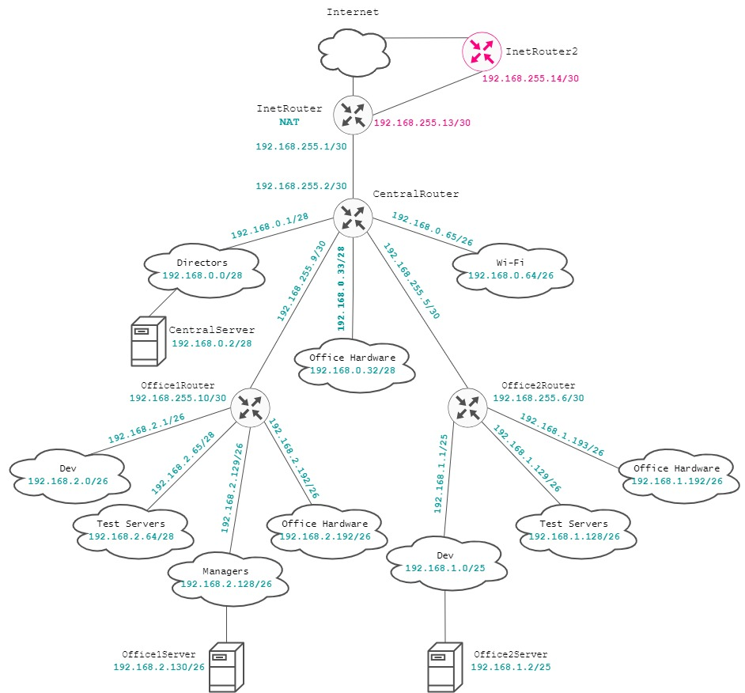

# Otus Homework 20. Iptables.
### Цель домашнего задания
Написать сценарии iptables.
### Описание домашнего задания
1. Реализовать knocking port
    - centralRouter может попасть на ssh inetrRouter через knock скрипт
2. Добавить inetRouter2, который виден с хоста или форвардится порт через localhost
3. Запустить nginx на centralServer
4. Пробросить 80й порт на inetRouter2 8080. Дефолт в инет оставить через inetRouter.
5. (*) Реализовать проход на 80й порт без маскарадинга
## Выполнение
Возьмем за основу схему из задания [Архитектура сетей](https://github.com/nikitinya89/otus_hw18_network). Добавим **inetRouter2** и соединим его с **inetRouter**, используя свободную подсеть *192.168.255.12/30*. Итоговая схема сети примет следующий вид:

#### Реализовать port knocking
**Port knocking** — это сетевой защитный механизм, действие которого основано на следующем принципе: сетевой порт является по-умолчанию закрытым, но до тех пор, пока на него не поступит заранее определённая последовательность пакетов данных, которая «заставит» порт открыться.
